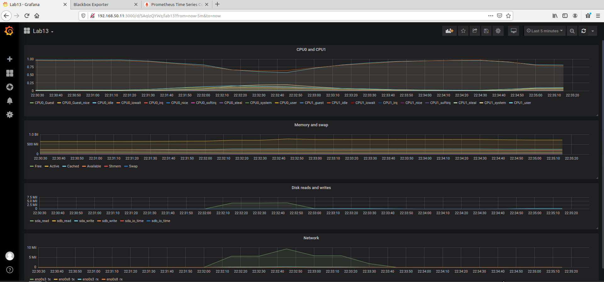

# Домашнее задание №13

Настройка мониторинга  
Настроить дашборд с 4-мя графиками  
    1) память  
    2) процессор  
    3) диск  
    4) сеть  

настроить на одной из систем
- zabbix (использовать screen (комплексный экран))
- prometheus - grafana

Стенд поднимался по вагрантфайлу [Vagrantfile](Vagrantfile)) с ансиблом из архива [monprom_stand-5522-66282e.tar](monprom_stand-5522-66282e.tar), экспортированный конфиг JSON файл [здесь](grafana_web_server_JSON.txt) с соответсвующим скриншотом: 

---
Соответствующие файлы:  
ansible log [здесь](ansible.log)  
Vagrantfile [здесь](Vagrantfile)  
prometheus config [здесь](grafana_web_server_JSON.txt) 